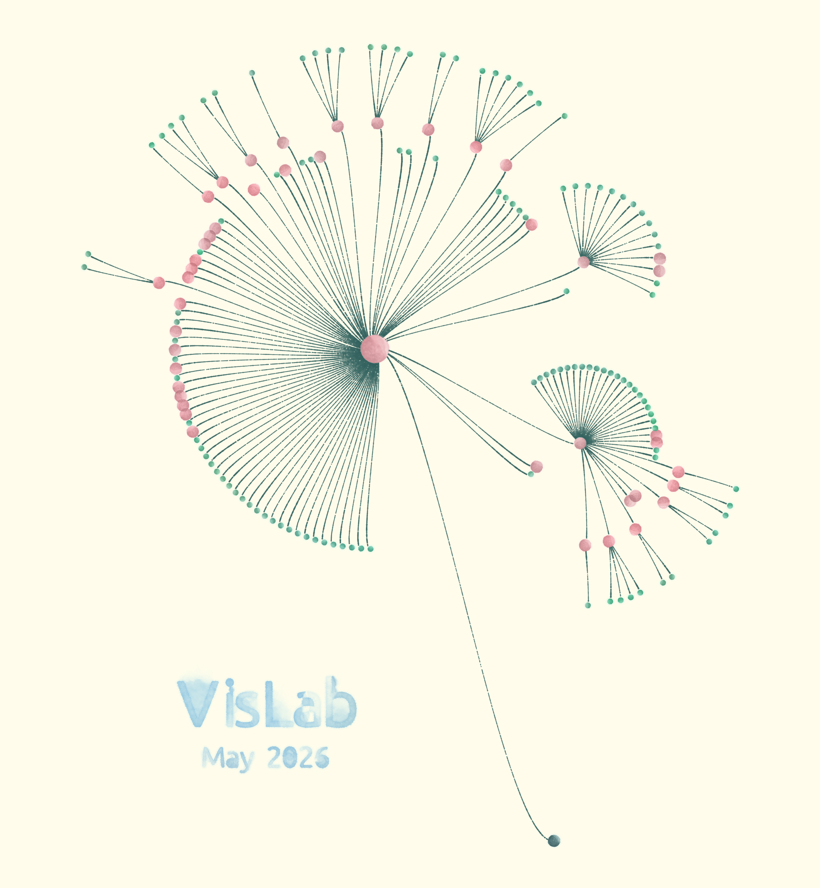

# Academic Family Dandelion

Interactive academic family tree rendered with [p5.js](https://p5js.org/) and [p5.brush](https://github.com/acamposuribe/p5.brush) for organic brush-stroke edges and nodes.



## Development

```bash
npm install
npm run dev
```

Open the URL shown in the terminal (usually `http://localhost:5173`).

## Build (GitHub Pages)

Production build outputs to the `docs/` folder for GitHub Pages:

```bash
npm run build
```

In the repository settings, enable **GitHub Pages** with source **Deploy from branch** → branch `main` (or `master`) → folder `/docs`.

The site is served at:

`https://<your-username>.github.io/Academic-Family-Dandelion/`

## Data

Tree data lives in `src/data/huamin-tree.csv`. Edit the CSV and rebuild to update the visualization.

## Features

- Radial layout of advisors and students
- Watercolor-style brush rendering
- Click nodes for details; export the canvas as PNG
